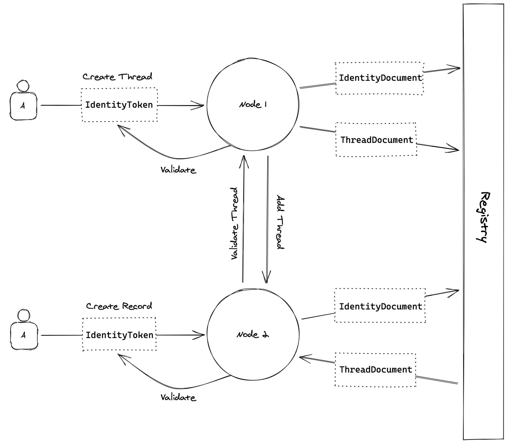
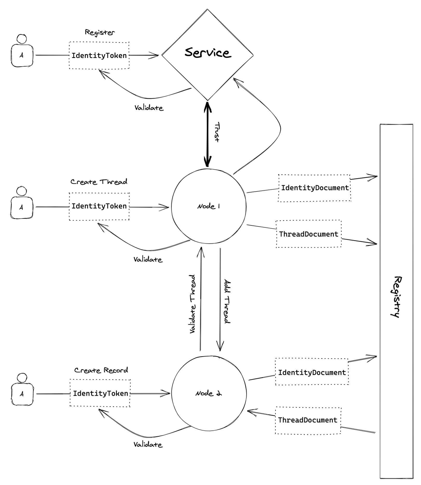

# Introduction

Core components of the decentralized web, such as data storage, have received a great deal of attention, including projects such as the Interplanetary File System (IPFS) [@benetIPFSContentAddressed2014], Filecoin [@protocollabsFilecoinDecentralizedStorage2017], Sia [@vorick2014sia], and Storj [@Wilkinson14storja]. These projects are demonstrating that distributed, (incentivized) storage is possible, and even profitable. However, _services_ such as those traditionally found in centralized systems via open (or closed) application programing interfaces (APIs) are less common in p2p systems. Examples might include RESTFul or RPC-style APIs, data services, web-hooks, etc.

The "Thread Network" proposed here is a proof-of-concept that aims to address this shortcoming. The system consists of a network of peers working to manage the discovery of a set of p2p services. In this paper, we focus on a core piece of this proposed system: service discovery. We propose the use of decentralized identifiers (DID) as a means to discover peer-to-peer services.

# Background

## Alternatives

Existing alternatives for connecting p2p services exist in the literature (see for example [@deLange2019decentralized] and references therein), and in practice. Indeed, a recent promising project in the blockchain space includes the Fluence distributed computing protocol [@fluence2020fluence]. The work proposed here is not meant to replace these systems, but rather compliment them. The "Thread Network" is designed to be simple, lightweight, and practical in the very near-term. It leverages existing specifications and protocols (namely, Threads and DIDs), does not require a blockchain or strict consensus protocol, and builds on tooling that already exists as part of the IPFS/Filecoin ecosystem (libp2p + gossip-sub).

## Decentralized Identifiers

A decentralized identifier, or DID, is a string identifier of a _subject_, controlled by a _controller_. A DID might be used to encode a reference to an account address [@ethrDidResolver] on the Ethereum [@buterin2014next, @wood2014ethereum] blockchain, identify a resource on a network of IoT (Internet of Things) devices, or even represent a unique "identity" such as a user or organization [@ceramic2021Protocol]. For DIDs to be useful, they must be "resolvable" without reliance on a centralized network component. [@Fig:did-overview] shows the interactions between DID components.

![The basic components of DID architecture. Source: [@reed2020decentralized] sec 1.3](./assets/did-overview.jpg){#fig:did-overview}

The _Verifiable Data Registry_ in @fig:did-overview could be a blockchain or peer-to-peer network. The meaning of _verification_ differs between DID implementations -- some provide a high level of verification through blockchain transactions, while others rely purely on the assumption that the majority of peers are _good actors,_ (e.g., IPID, an IPNS-based DID).

A DID can identify any actor or structure in the network (the _subject_), and should resolve to a _document_ that is accessible from anywhere in the network. Formally, a DID document describes the _subject_, and the document is controlled by one or more _controllers_. In practice, these are often the same entity, though a subject may delegate control to a separate controller. In short, DIDs point to relationships between the components of a decentralized network. What can this component do? Who/what can do it? Who/what dictates who can do it? See [@reed2020decentralized] for the DID specification.

## Threads

A thread is a topic-based collection of single-writer logs. A collection of logs represent updates to the "state" of an object (or dataset). The basic units of a thread -- logs and records -- provide a framework for creating, storing, and transmitting data in a p2p network. The thread protocol is outline in detail in the threads whitepaper [@pick2020protocol].

A log within a thread is essentially a set of cryptographically linked (i.e., hash-linked) records, that form a specific type [@sanjuanMerkleCRDTs2019] of Merkle-DAG (directed acyclic graph) that represents a purely functional [@okasaki1999purely] and authenticated [@tamassia2003authenticated] (i.e., immutable) singly-linked list. The key insight here is that, assuming two peers have received all of the same updates to a thread, they will deterministically arrive at the same thread structure, and that thread structure can be summarized by the (set of) hash(es) of the head(s) of the underlying log(s).

# Thread DIDs

A major motivator for exposing a DID-native threads specification is the ability to uniquely identify an append-only log on the network, without any "centralized" coordination. This is important, because it allows developers to leverage access controlled storage APIs without having to worry about API keys, and with increased user-control of data, all while leveraging the benefits that come with a decentralized p2p system built on a content-addressable data layer, such as IPFS. Indeed, the ability to advertise thread-based services to the network and allow crypto-native/web 3.0 users the ability to leverage and pay for said services without API keys is a major break-through in web-based service architecture. One might think of this new architecture as crypto-native distributed micro-services.

In practice, a thread _network_ may have multiple actors and structures (subjects) that can be described by DID documents. Subjects include any of the following entities:

Peers
: (e.g., `did:p2p:foo`) can offer network services, such as thread "hosting", pinning services (i.e., IPFS, IPNS), Filecoin anchoring, API services, and more. A thread peer's DID is derived from its embedded networking host's key (which in practice is a `libp2p` (`https://libp2p.io`) peer]).

Users
: (e.g., `did:key:foo`, `did:3:foo`, `did:ethr:foo`, etc.) are any external identity that represents a network user, and that may interact with the network _via_ a Peer. These may be identified by any verifiable DID.

Thread
: &nbsp; (e.g., `did:thread:id`) documents contain verification methods for all valid peers and/or users. Other thread info such as the _log head_, _log metadata_, and _thread encryption keys_ are _not_ stored in the DID document, as this information is only needed by peers that are sharing a thread, and can be more efficiently exchanged using the thread protocol [@pick2020protocol] directly (vs. a global document registry). _Log addresses_ are referenced as _service endpoints_, as defined in [@reed2020decentralized] sec 5.4.

By identifying a thread as a global resource, any peer can determine the following from its DID:

1.  Who can write to the thread?
2.  Who can read from the thread?
3.  Where can the thread be bootstrapped from?
4.  Who controls (1), (2), and (3)?

It is important to note that a thread DID is an _identifier_, not an _identity_ in the usual sense. To illustrate, a thread is considered a resource that a peer on the network is attempting to identify, i.e., the thread itself _is the subject_, and the thread DID document is a _representation of the subject_. However, unlike in many DID-base schemes (particularly those focused around identity), the thread is _never_ the controller of the DID [@reed2020decentralized]. The controller is always one or more identity-based DIDs, e.g., `did:key:foo`, `did:ethr:foo`, `did:3:foo`, etc., and the thread DID _delegates_ to its controller.

This distinction is important, as it implies that a thread cannot "act" or be "acted upon" on its own. Additionally, it provides a (so far, loose) definition of access control to a thread's DID document: access is granted to the controllers listed in the document. These controllers are publicly visible, and must be resolvable by the network. Additionally, it provides a means to validate the thread DID document: all updates must be signed by a delegate (controller), and given the hash-linked structure of a thread, the entire history of said updates can be audited and verified.

## Document Structure

The canonical DID document structure has yet to be established. However, an initial, working prototype thread DID document is structured as in [@lst:thread-did]. In this example, the controller (`did:key:foo`) is defined by a key-based DID [@longely2021didKey]. The controller is able to modify the thread DID document. Additionally, both `did:key:foo"` and `did:key:bar"` can authenticate as `did:thread:id`, meaning they are part of the access control list (ACL), or have "controlled access" to the thread, allowing them to sign and append records to a thread log directly, or via a thread peer. Finally, the thread DID document in [@lst:thread-did] also specifies two `serviceEndpoint`s that outlines which peers (`/p2p/peer-id-1` and `/p2p/peer-id-2`) are able to connect to and download logs/records from the thread (this is an illustrative, rather than canonical, example of the use of the services entry).

<div id="lst:thread-did" class="listing">
Proposed thread DID Document structure.

```{.json}
{
  "@context": "https://www.w3.org/ns/did/v1",
  "id": "did:thread:id",
  "controller": "did:key:foo",
  "authentication": [
    {
      "id": "did:key:foo#keys-1",
      "type": "Ed25519VerificationKey2018",
      "controller": "did:key:foo",
      "publicKeyBase58": "..."
    },
    {
      "id": "did:key:bar#keys-1",
      "type": "Ed25519VerificationKey2018",
      "controller": "did:key:bar",
      "publicKeyBase58": "..."
    }
  ],
  "service": [
    {
      "id": "did:thread:<id>#peer-id-1",
      "type": "threadService",
      "serviceEndpoint": "/p2p/peer-id-1",
      "serviceProtocol": "/thread/0.0.1"
    },
    {
      "id": "did:thread:<id>#peer-id-2",
      "type": "threadService",
      "serviceEndpoint": "/p2p/peer-id-2",
      "serviceProtocol": "/thread/0.0.1"
    }
  ]
}
```

</div>

# Method Definition

The crux of any DID implementation is defining it's _DID method_. The DID specification defines a _method_ as a "means to implement this specification on different verifiable data registries" [@reed2020decentralized (sec 8)]. The core function of the spec is to ensure interoperability between different DID methods.

Here we define a DID method specification for threads which is composed of a _method scheme_ (see [@reed2020decentralized] sec 3.1) and _operations_ (sec 8.2). Operations specify how a DID document is created, how to read/verify a document, as well as how a DID controller can update or even deactivate a DID document. The method scheme defines the structure of the DID implementation's string identifier(s).

## Method Scheme

A thread DID method scheme prefixes the unique identifier for a thread (see [@pick2020protocol] sec 2.2), with the globally unique `did:thread:` namespace, such that a thread DID becomes `did:thread:<thread-id>`, where `thread-id` is defined as:

$$ \underbrace{\texttt{0x62}}_\text{Multibase} \overbrace{\texttt{0x01}}^\text{Version} \underbrace{\texttt{0x55}}_\text{Variant} \overbrace{\texttt{0x539bc}\dots\texttt{a4546e}}^\text{Random Component} $$

This produces a string identifier of the form: `"did:thread:bafk6npbyp...6mfuhoe6iesr"`. A random component is used here in practice, because Threads are designed to be uniquely identifiable, but not necessarily tied to a given key or identity. An alternative specification might derive from an asymmetric key pair held by the controller (with some additional contextual information), though see some of the previously stated motivations for the separation of subject from controller for potential limitations here.

## Method Operations

As mentioned perviously, DID methods define a set of operations that can be performed on/with DID documents. DID implementations often use a smart contract [@buterin2014next] on a blockchain like Ethereum to model the global data registry, and to implement these operations. For the implementation proposed here, we assume that documents are stored in such a way that they are made available to resolvers via the registry, or directly via IPFS/IPNS. In the future, documents could be stored on the Filecoin blockchain as non-fungible token (NFT) _actor_ types.

In our initial proof-of-concept network, a non-consensus driven global data registry is used, based on a p2p "gossip" protocol. In practice, this is implemented using libp2p's gossip-sub implementation. This registry provides weak consensus, along the lines of IPNS-over-pubsub [@santos2020IPNS]. The process of getting a DID subject's document from the verifiable data registry is called _resolution_. Any peer can resolve any document by querying the on-chain NFT representing the subject, or in the shorter-term case, by posting queries to the associated pubsub channel.

# Architecture

The network architecture should be flexible enough that it can support a wide-range of services while remaining straightforward for application developers. The way in which a DID method is leveraged is entirely up to the network itself. Here we outline some system requirements and walk through some common network operations.

## Basic Network

First, let's consider a network of completely open peers. Open here means _no identity authorization_, such that anyone can create/add and read/write to threads.

A minimal set of requirements for this type of network to operate includes allowing external identities to leverage a peer (local or otherwise reachable by the user) to create threads. Once a thread is created, it can be considered globally available, i.e., thread peers can do work on behalf of other thread peers.

In practice, only peers that have been used to read/write to a given thread will follow said thread, and as with most other operations, any peer can be used to delete a thread. A simplified representation of a "basic" thread network such as this is shown in [@fig:vanilla-network]. In this case, the network consists of $n=2$ peers interacting with an external identity $A$ that is requesting operations.

{#fig:vanilla-network}

## Services

In our hypothetical basic network network, one of the peers has a _trusted relationship_ with a service. Peers can advertise their services using the `services` DID field. For example, consider a hypothetical web-hook service that allows users to add web-hooks to a thread. Every time the thread receives an update, the web-hook fires on the user-defined endpoint. The peer's DID document includes the service information shown in Listing 2.

<div id="lst:did-services" class="listing">
Thread DID Document with service information.

```{.json}
{
  "services": [
    {
      "id": "did:key:peer-id#threads",
      "type": "threadService",
      "serviceEndpoint": "/p2p/peer-id",
      "serviceProtocol": "/thread/0.0.1"
    },
    {
      "id": "did:key:peer-id#webhooks",
      "type": "threadWebHookService",
      "serviceEndpoint": "/p2p/peer-id",
      "serviceProtocol": "/thread/0.0.1",
      "cost": {
        "hook": {
          "amount": "xx nanoFIL",
          "currency": "FIL"
        },
        "hit": {
          "amount": "xx nanoFIL",
          "currency": "FIL"
      }
    }
  ]
}
```

</div>

Services in this context are relatively flexible, and because "trust" is handled in separate layers of the system (i.e., via blockchain transactions, payment services, contracts, etc.), services can define their own authorization patterns. Services may be free, have free quotas, only be open to some users, etc.

To work with the Thread Network, a peer's services must be discoverable from their DID document. Services must also be self-describing via the DID service `type` , `serviceEndpoint`, and `description` fields. The community can maintain a list of available services by type to further aide in service discovery.

As alluded to above, service discovery is a key feature of the proposed system. Peers/users must be able to discover services on the network, without relying on a single "indexer" or centralized API. In this initial proof-of-concept, service discovery is handled via peer gossip/pubsub: Peers are used to request service types across the whole network via libp2p pubsub messages. Matching host peers respond directly to the caller with a verifiable service description.

{#fig:service-network}

At a minimum, a peer will advertise it's own `libp2p` thread API. One of the key goals for the Threads Network is to enable (and encourage) external tool integration. By this we mean the ability to synchronize data to the threads network via existing tools such as databases (e.g., MongoDB, PostgreSQL, Redis), chat and messaging protocols (e.g., Matrix, ActivityPub), rich text editors (e.g., Quill, Slate, CodeMirror), etc. Here are some examples of additional services a peer might offer:

- Buckets
  - Mutable filesystem API
  - Pinning API
- A `go-datastore` interface (key-value store)
- Web-hooks
- Filecoin
  - Thread anchoring
  - Bucket archiving
  - Deal retrievals
- Databases
  - MongoDB (e.g., direct connection URI)
  - PostgreSQL
- Media encoding
- etc.

In addition to exposing more "traditional" web2 APIs (e.g., REST, gRPC, etc.) as services, it is possible to expose these APIs over p2p protocols. For example, it is possible to allow peers to serve HTTP endpoints and make HTTP requests through `libp2p` using Go's standard "http" and "net" stack. This provides a simple on-ramp for web 2.0 developers to expose their APIs over the threads p2p network. Couple service provision and remote database access with the robust authentication and globally identifiable assets afforded by thread DIDs, and we now have a very clear path to onboarding web2 developers (and data) to the decentralized web.

# Conclusions

Decentralized identifiers (DIDs) enable cross-protocol/blockchain interactions by defining a common interface to retrieve and validate entities, such as users and data. A DID-driven threads network offers an exciting opportunity to expose p2p services as first-class components of a p2p network.

Threads and IPFS/Filecoin benefit from a native DID in the following key ways (among others): 1) DIDs provide globally-unique namespaces for resources, such that thread IDs act as identifiers to network-wide resources; 2) adopting a standardized system for resource identification increases ecosystem(s) interoperability, facilitating integration with external DID methods available on systems such as Filecoin or Ethereum, as well as a range of identity solutions (e.g., Ceramic/IDX); 3) the use of DID-base threads provides "crypto-native" access to off-chain data, this includes Filecoin integration; and 4) globally unique identifiers pave the way for _distributed authorization_ to network resources, this is because access control mechanisms are globally and unambiguously defined, which leads to a net increase in the decentralization of network services.

In addition to distributed authorization, DIDs also enable open, decentralized, service _discovery_. This is a major stumbling block to many/most p2p systems. Additionally, because any peer is capable of discovering and resolving thread DID namespaces, and because all operations on a thread lead to deterministic, content-addressable updates, network peers can do work on each others' behalf. This opens the door to a kind of "market" of services, where providers and brokers could attempt to compete on price, uptime, etc.

What is next for thread DIDs? Development of governance policies and standardization of norms for the internal structure used within the DID document -- e.g. how webhooks and other services are described -- is required to push towards interoperable service definitions. Building on this, who or what, organization(s) maintain(s) or coordinate(s) the document structure in the long term is an open question. Additionally, conventions around the separation of _thread access_ from _thread DID access_ remain unspecified. As part of the process of canonicalizing the thread DID representation, conventions for providing more fine-grained access control will be useful.

# Acknowledgements

The authors thank Ignacio Hagopian, Aaron Sutula, Aaron Steele and three anonymous reviewers for their helpful comments that improved this work-in-progress paper, and identified critical areas for further development and research/exploration.

# References
