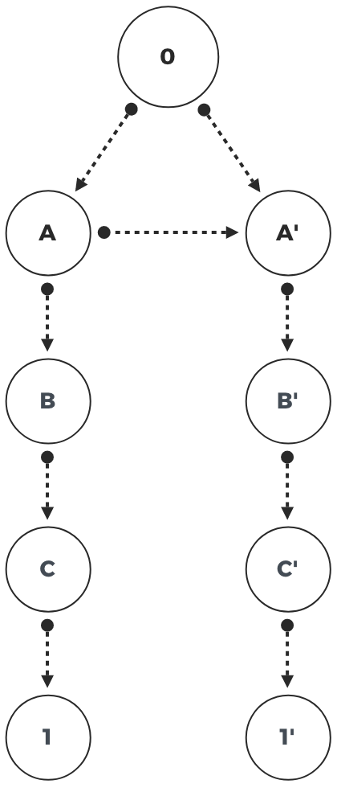
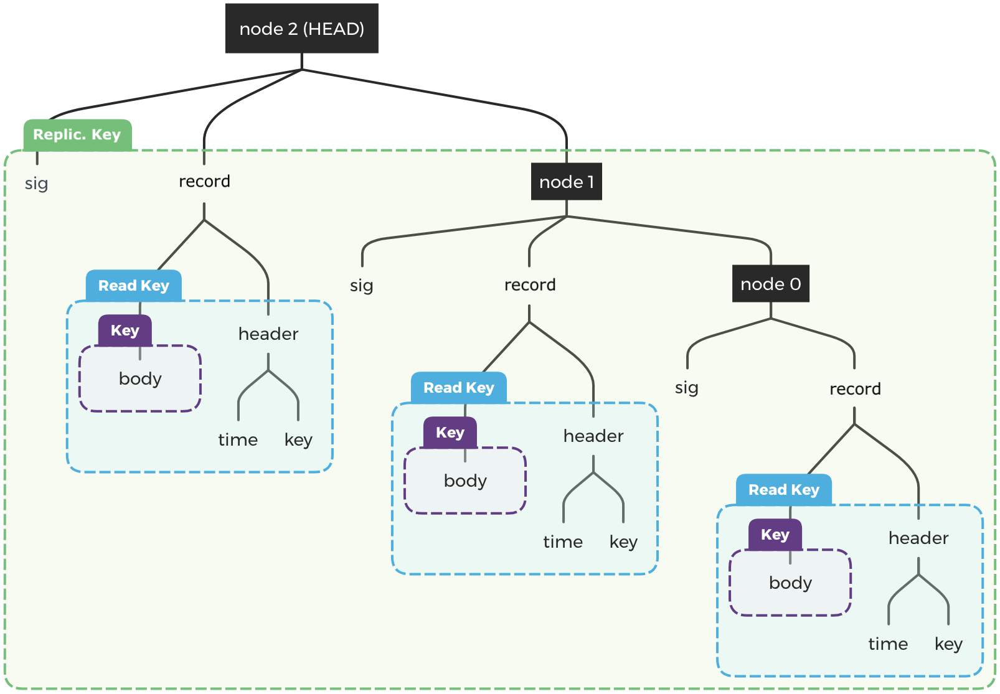
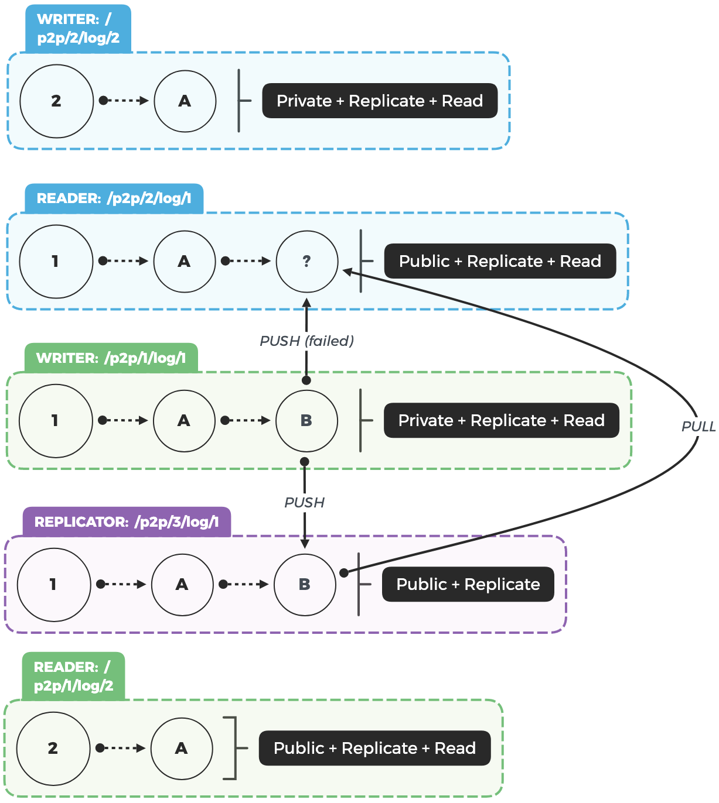

Introduction
============

Compared to their predecessors, modern cloud-based apps and services
provide an extremely high level of convenience. Users can completely
forget about data management, and enjoy seamless access to their apps
across multiple devices. This convenience is now expected, but has come
at the cost of additional consequences for users. One such consequence
is that many of the same development patterns that bring convenience
(e.g., single sign-on, minimal encryption, centralized servers and
databases) also enable, or even require data hoarding by apps. While
collecting large amounts of users' data can create value for the
companies building apps (e.g., app telemetry, predictive tools, or even
new revenue streams), that value flows mostly in one direction: apps
collect, process and benefit from a user's private data, but users
rarely have access to the original data or the new insights that come
from it. Additionally, the data is generally not accessible to other
apps and services. This is *app-siloed* data.

While the fact that companies collect user data may not itself be a
significant problem, problems may arise if over time a company's
incentives shift from *providing* value to users, to *extracting* value
from users [@dixonWhyDecentralizationMatters2018]. When this incentive
shift happens, companies that have been creating data-silos may treat
that data as new source of value or revenue for the company. It may be
possible to stop this trend through extreme privacy measures, government
intervention or legislation, or by boycotting companies that collect any
form of data. Ideally, there is an alternative approach that allows
individuals to capture the value of their data and still allow
developers to build new interfaces and experience on top of this data.
This approach is called *user-siloed* data and it fundamentally
separates apps from their users' data.

One of the most exciting aspects of user-siloed data is the ability to
build data-driven apps and services while users remain in control of
their own data. Other projects have identified app-siloed data as a
problem [@bernersLee_readwrite_2013; @de_montjoye_trusted_2012], and
some have identified user-siloed data as a solution
[@sambraSolidPlatformDecentralized2016]. However, none so far have
addressed the problem of *how data should be collected to make it
extensible*, nor have they provided a sufficiently interoperable
protocol for scalable storage, transmission, and use of user-siloed
application data.

In this paper, we study existing technologies that could be used to
build a network for user-siloed data. We outline six challenge areas:
flexible data formats, efficient synchronization, conflict resolution,
access-control, scalable storage, and network communication. Based on
our findings, we propose a novel architecture for event sourcing (ES)
with Interplanetary Linked Data (IPLD) --- which we call *Threads* --
that is designed to store,
share, and host user-siloed data-sets at scale. Our proposed design
leverages new and existing protocols to solve major challenges with
building a secure and distributed network for user data while at the
same time providing the flexibility and scalability required by today's
apps.

Background {#sec:Background}
==========

We now describe some of the technologies and concepts motivating the
design of our novel decentralized database system. We highlight some of
the advantages and lessons learned from event sourcing (ES) and discuss
drawbacks to using these approaches in decentralized systems. We provide
an overview of some important technologies related to the Interplanetary
File System (IPFS) that make it possible to rethink ES in a
decentralized network. Finally, we cover challenges to security and
access control on an open and decentralized network, and discuss how
they are designed in popular database management (DBMS) systems outside
the IPFS context.

Data Synchronization
--------------------

To model realistic systems, apps often need to map data between domain
models and database tables, where the same data model is used to both
query and update a database. To solve *synchronization* it is often
helpful to handle updates on just the database and then provide the
query and interfaces only later in a DBMS. One powerful approach to
synchronization is to use a set of append-only logs to model the state
of an object simply by applying its change sequence in the correct
order. This concept can be expressed succinctly by the state machine
approach [@schneiderImplementingFaulttolerantServices1990]: if two
identical, deterministic processes begin in the same state and get the
same inputs in the same order, they will produce the same output and end
in the same state. This is a powerful concept baked into a simple
structure, and is at the heart of many distributed database systems
[@jaykrepsLogWhatEvery2013].

[Logs or Append-only Log]{#def:Logs}
: A log is a registry of database transactions
that is read sequentially (normally ordered by time) from beginning to
end. In distributed systems, logs are often treated as append-only,
where changes or updates can only be added to the set and never removed.

### CQRS, Event Sourcing, and Logs {#sec:cqrs}

For most apps, it is critical to have reliable mechanisms for publishing
updates and events (i.e., to support event-driven architectures),
scalability (optimized write and read operations), forward-compatible
application updates (e.g., code changes, retroactive events), auditing
systems, etc. To support such requirements, developers have begun to
utilize event sourcing and command query responsibility segregation
(CQRS) patterns [@bettsExploringCQRSEvent2013], relying on append-only
logs to support immutable state histories. Indeed, a number of
commercial and open source software projects have emerged in recent
years that facilitate ES and CQRS-based designs, including Event Store
[@EventStore], Apache Kafka [@ApacheKafka] and Samza [@ApacheSamza],
among others [@kleppmannDesigningDataintensiveApplications2017].

CQRS
: Command query responsibility segregation or CQRS is a design
pattern whereby reads and writes are separated into different models,
using commands to write data, and queries to read data
[@martinfowlerCQRS2011].

ES
: Event sourcing or ES is a design pattern for persisting the state
of an application as an append-only log of state-changing events.

A key principal of ES and append-only logs is that all changes to
application state are stored as a sequence of events. Because any given
state is simply the result of a series of atomic updates, the log can be
used to reconstruct past states or process retroactive updates
[@fowlerEventSourcing]. The same principal means a log can be viewed as
a mechanism to support an infinite number of valid state interpretations
(see [@sec:ViewsProjections]). In other words, with minimal
conformity, a single log can model multiple application states
[@microsoftcorporationAzureApplicationArchitecture].

### Views & Projections {#sec:ViewsProjections}

In CQRS and ES, the separation of write operations from read operations
is a powerful concept. It allows developers to define views into the
underlying data that are best suited for the use case or user interface
they are building. Multiple (potentially very different) views can be
built from the same underlying event log.

View
: A (typically highly de-normalized) read-only model of event
data. Views are tailored to the requirements of the application, which
helps to maximize display and query performance. Views that are backed
by a database or filesystem-optimized access are referred to as
materialized views.

Projection
: An event handler and corresponding reducer/fold function
used to build and maintain a view from a set of (filtered) events. While
projections may lead to the generation of new events, their reducer
should be a pure function.

Views themselves are enabled by projections[^1], which can be thought of
as transformations that are applied to each event in a stream. They
update the data backing the views, be this in memory or persisted to a
database. In a distributed setting, it may be necessary for projections
to define and operate as eventually consistent data structures, to
ensure all Peers operating on the same stream of events have a
consistent representation of the data.

### Eventual Consistency {#sec:EventualConsistency}

The CAP theorem
[@brewerRobustDistributedSystems2000; @gilbertBrewerConjectureFeasibility2002a]
states that a distributed database can guarantee only two of the
following three promises at the same time: consistency (i.e., that every
read receives the most recent write or an error), availability (i.e.,
that every request receives a \[possibly out-of-date\] non-error
response), and partition tolerance (i.e., that the system continues to
operate despite an arbitrary number of messages being dropped \[or
delayed\] by the network). As such, many distributed systems are now
designed to provide availability and partition tolerance by trading
consistency for *eventual* consistency. Eventual consistency allows
state replicas to diverge temporarily, but eventually arrive back to the
same state. While an active area of research, designing systems with
provable eventual consistency guarantees remains challenging
[@shapiroComprehensiveStudyConvergent2011a; @almeidaDeltaStateReplicated2018].

[CRDT]{#def:CRDT}
: A conflict-free replicated data type (CRDT) assures eventual
consistency through optimistic replication (i.e. all new updates are
allowed) and eventual merging. CRDT rely on data structures that are
mathematically guaranteed to resolve concurrent updates the same way
regardless of the order in which those events were received.

How a system provides eventual consistency is often decided based on the
intended use of the system. Two well-documented categories of solutions
include logs (def. [1](#def:Logs)) and CRDT (def. [2](#def:CRDT)).

A common minimum requirement for log synchronization across multiple
peers is that the essential order of events is respected and/or can be
determined
[@schwarzDetectingCausalRelationships1994; @katzInterleavingSetTemporal1990].
For these cases, logical clocks are a useful tool for eventual
consistency and total ordering [@kulkarniLogicalPhysicalClocks2014].
However, some scenarios (e.g., temporarily missing events or ambiguous
order) can force a replica into a state that cannot be later resolved
without costly recalculation. In specific cases, CRDTs can provide an
alternative to log-based consensus (see [@sec:CRDTs]).

### Logical Clocks {#sec:LogicalClocks}

In a distributed system with multiple peers (each with an independent
clock) creating events, local timestamps can't be used to determine
"global" event causality. Machine clocks are never perfectly
synchronized [@lamportTimeClocksOrdering1978], meaning that one peer's
concept of "now" is not necessarily the same as another. Machine speed,
network speed, and other factors compound the issue. For this reason,
simple wall-clock time does not provide a sufficient notion of order in
a distributed system. Alternatives to wall-clock time exist to help
achieve eventual consistency. Examples include various logical clocks
(Lamport [@lamportTimeClocksOrdering1978] Schwartz
[@schwarzDetectingCausalRelationships1994], Bloom
[@ramabajaBloomClock2019], and Hybrid variants
[@kulkarniLogicalPhysicalClocks2014], etc.), which use "counter"-based
time-stamps to provide partial ordering.

Cryptographically linked events can also represent a clock (see
[@sec:merkleclocks]). One such example is called the
Merkle-Clock [@sanjuanMerkleCRDTs2019], which relies on properties of a
Merkle-DAG to provide strict partial ordering between events.
Like any logical clock, this approach does have its limitations
[@sanjuanMerkleCRDTs2019 sec. 4.3]:

> Merkle-Clocks represent a strict partial order of events. Not all
> events in the system can be compared and ordered. For example, when
> having multiple heads, the Merkle-Clock cannot say which of the events
> happened before.

### Conflict-Free Replicated Data Types {#sec:CRDTs}

CRDTs (def. [2](#def:CRDT)) are one way to achieve strong eventual
consistency, where once all replicas have received the same events, they
will arrive at the same final state, *regardless of ordering*[^2]. A
review of the types of possible CRDTs is beyond the scope of this paper,
however, it is important to note their role in eventually consistent
systems and how they relate to clock-based event ordering. See for
example [@enesSingleWriterPrincipleCRDT2017; @sanjuanMerkleCRDTs2019]
for informative reviews of these types of data structures.

Whether a system (e.g., an app) uses a CRDT or a clock-based sequence of
events is entirely dependent on the use-case and final data model. While
CRDTs may seem superior (and are currently a popular choice among
decentralized systems), it is not possible to model every system as a
CRDT. Additionally, the simplicity of clock-based sequencing often makes
it easier to leverage in distributed systems where data conflicts will
only rarely arise. Lastly, logs and CRDTs are not mutually exclusive and
can be used together or as different stages of a larger system.

Content-based Addressing
------------------------

Internet application architecture today is often designed as a system of
clients (users) communicating to endpoints (hosts or servers).
Communication between clients and endpoints usually happens via the
TCP/IP protocol stack and depends on *location-based addressing*.
Location-based addressing, where the client makes a request that is
routed to a specific endpoint based on prior knowledge (e.g., the domain
name or IP address), works relatively well for many use-cases. However,
there are many reasons why addressing content by location is
problematic, such as duplication of storage, inefficient use of
bandwidth, invalid/dead links (link rot), centralized control, and
authentication issues.

An alternative to location addressing, called *content-based
addressing*, may provide a solution to many of the problems associated
with location-based addressing. Content-based addressing is where the
content itself is used to create an address which is then used to
retrieve said content from the network
[@mortContentBasedAddressing2012].

### IPFS & Content-based Addressing

There are a number of systems that utilize content-based addressing to
access content and information (e.g. Git, IPFS, Perkeep, Tahoe-LAFS,
etc), and there is an active body of literature covering its design and
implementation
[@benetIPFSContentAddressed2014; @selimi_tahoeLafs_2014; @rhea_fast_2008].
The Interplanetary File System (IPFS) --- which is a set of protocols to
create a content-addressed, peer-to-peer (P2P) filesystem --- is one
such system [@benetIPFSContentAddressed2014]. In IPFS, the address for
any piece of content is determined based on a cryptographic hash of the
content itself. In practice, an IPFS Content IDentifier (CID) is a
multihash, which is a self-describing "protocol for differentiating
outputs from various well-established cryptographic hash functions,
addressing size \[and\] encoding considerations"
[@protocollabsMultihash]. That addressing system confers several
benefits to the network, including tamper resistance (i.e., a given
piece of content has not been modified en route if its hash matches what
we were expecting), de-duplication (i.e., the same content
from different peers will produce the same hash address), and data-corruption
(again if a hash matches what we were expecting, we
know it is complete). Additionally, IPFS content-based addresses are
immutable and universally unique.

{#fig:contentaddressing height="350px"}

While content-based addressing doesn't dictate to a Peer *how* to get a
piece of content, IPFS (via libp2p[^3]) does provide a system for moving
content across the network. On the IPFS network, a client who wants
specific content requests the CID from the network of IPFS hosts. The
client's request is routed to the first host capable of fulfilling the
request (i.e., the first host that is actively storing the content
behind the given CID). The IPFS network can be seen as a distributed
file system, with many of the benefits that come with this type of
system design.

### IPLD

As discussed previously, IPFS uses the cryptographic hash of a given
piece of content to define its content-based address (see
[@benetIPFSContentAddressed2014] for details on this process). However,
in order to provide standards for accessing content-addressable data (on
the web or elsewhere), it is necessary to define a common format or
specification. In IPFS and other systems [e.g.
@protocollabsFilecoinDecentralizedStorage2017], this common data format is called
Interplanetary Linked Data (IPLD)[^4]. As the name suggests, IPLD is
based on principals of linked data
[@berners-leeLinkedData2009; @bizerLinkedDataStory2011] with the added
capabilities of a content-based addressing storage network.

IPLD is used to represent linked data that is spread across different
"hosts", such that everything (e.g., entities, predicates, data sources)
[@heathLinkedDataEvolving2011] uses content-based addresses as unique
identifiers. To form its structure, IPLD implements a Merkle DAG, or
directed acyclic graph[^5]. This allows all hash-linked data structures
to be treated using a unified data model, analogous to linked data in
the Semantic Web sense
[@brendanobrienDeterministicQueryingDistributed2017]. In practice, IPLD
is represented as objects, each with `Data` and (possibly multiple) `Link`
fields, where `Data` can be a small blob of unstructured, arbitrary binary
data, and a `Link` simply 'links' to other IPLD objects.

### Merkle-Clocks {#sec:merkleclocks}

{#fig:merkledag height="350px"}

A Merkle-Clock is a Merkle-DAG that represents a sequence of events, or
a log [@sanjuanMerkleCRDTs2019]. When implemented on IPFS (or an
equivalent network where content can be cryptographically addressed and
fetched), Merkle-Clocks provide a number of benefits for data
synchronization between replicas [@sanjuanMerkleCRDTs2019 sec. 4.3]:

1.  Sharing the Merkle-Clock can be done using only the *head*[^head] CID. The
    whole Clock is unambiguously identified by the CID of its head, and
    its full structure can be traversed as needed.
2.  The immutable nature of a Merkle-DAG allows every replica to perform
    quick comparisons, and fetch only those nodes (leaves) that it is
    missing.
3.  Merkle-DAG nodes are self-verified and immune to corruption and
    tampering. They can be fetched from any source willing to provide
    them, trusted or not.
4.  Identical nodes are de-duplicated by design: there can only be one
    unique representation for every event.

However, since Merkle-Clocks are logical clocks (see [@sec:LogicalClocks]),
they cannot be used order divergent heads representing concurrent
events alone. For example, in [@fig:merkledag], two replicas (left and right
columns) are attempting to write (top to bottom) events to the same Merkle-Clock.
After the first replica writes event A, the second writes event A' and 
properly links to A. At that point, perhaps the two replicas stop receiving
events from one another.
To a third replica (not pictured) that does continue to receive
events, there would now be two independent heads, 1 and 1'. For the third
replica, resolving these two logs of events may be costly (many updates
happened since the last common node) or impossible (parts of the chain
may not be available on the network).

In order to reduce the likelihood of divergent heads, all replicas
should be perfectly connected and be able to fetch all events and
linkages in the Merkle-Clock. On real-world networks with many often
replicas that are often offline (mobile and Internet of things (IoT)
devices, laptops, etc.), these conditions are rarely met, making the use
of a single Merkle-Clock to synchronize replicas problematic.

Networking
----------

So far we have primarily discussed the mechanics of creating or linking
content in a series of updates. Now we will overview some common
networking tools for connecting distributed peers who aim to maintain
replicas of a shared state. This could be any decentralized network of
interacting entities (e.g., cloud servers, IoT devices, botnets, sensor
networks, mobile apps, etc) collectively updating a shared state. IPFS
contains a collection of protocols and systems to help address the
networking needs of different use-cases and devices --- be it a phone,
desktop computer, browser, or Internet-enabled appliance.

### Libp2p

The libp2p project provides a robust protocol communication stack. IPFS
and a growing list of other projects (e.g., Polkadot, Ethereum 2.0,
Substrate, FileCoin, OpenBazzar, Keep, etc) are building on top of
libp2p. Libp2p solves a number of challenges that are distinct to P2P
networks. A comprehensive coverage of networking issues in P2P systems
is out of the scope for this paper, however, some core challenges that
libp2p helps to address include network address translator
[@srisureshIPNetworkAddress] (NAT) traversal, peer discovery and
handshake protocols, and even encryption and transport security ---
libp2p supports both un-encrypted (e.g. TCP, UDP) and encrypted (e.g.
TLS, Noise) protocols --- among others. Libp2p uses the concept of a
multiaddress to address peers on a network, which essentially models
network addresses as arbitrary encapsulations of protocols
[@protocollabsMultiaddr]. In addition to "transport layer" modules,
libp2p provides several tools for sharing and/or disseminating data over
a P2P network.

### Pubsub

One of the most commonly used P2P distribution layers built on libp2p,
is its Pubsub (or publish-subscribe) system. Pubsub is a standard
messaging pattern where the publishers don't know who, if anyone, will
subscribe to a given topic. *Publishers* send messages on a given topic
or category, and *Subscribers* receive only messages on a give topic to
which they are subscribed. Libp2p's Pubsub module can be configured to
utilize a *floodsub* protocol --- which floods the network with
messages, and peers are required to ignore messages in which they are
not interested --- or *gossipsub* --- which is a proximity-aware
epidemic Pubsub system, where peers communicate with proximal peers, and
messages can be routed more efficiently. In those implementations, there
is a benefit to using Pubsub in that no direct connection between
publishers and subscribers is required.

Another benefit to using Pubsub is the ability to publish topical
sequences of updates to multiple recipients. Like libp2p, encryption is
a separate concern and often added in steps prior to data transmission.
However, also like libp2p, Pubsub doesn't offer any simple solutions for
transferring encryption keys (beyond public keys), synchronizing
data-sets across peers (i.e. they aren't databases), or enforcing any
measures for access control (e.g. anyone subscribed to a topic can also
author updates on that topic). To solve some of these challenges, some
systems introduce message echoing and other partial solutions. However,
it makes more sense to use Pubsub and libp2p as *building blocks* in
systems that can effectively solve these issues, such as using
multi-modal communication strategies or leveraging tools such as
deferred routing (e.g. inboxing) for greater tolerance of missed
messages.

### IPNS

Our discussion of Pubsub and libp2p has so far only dealt with
*push-based* transfer of data; but IPFS also offers a useful technology
for hosting *pull-/request-*based data endpoints based on an
Interplanetary Name System (IPNS). IPNS aims to address the challenge of
mutable data within IPFS. It relies on a global namespace (shared by all
participating IPFS Peers) based on Public Key Infrastructure (PKI). By
using IPNS, a content creator generates a new address in the global
namespace and points that address to an endpoint (e.g. a CID). Using
their private key, a content creator can update the static route to
which the IPNS address refers. But IPNS isn't only useful for creating
static addresses pointing to content-based addresses; it is also
compatible with external naming systems such as DNS, Onion, or bit
addresses.

Unfortunately, many use-cases that require highly mutable data, also
require rapid availability of updates, or need flexible multi-party
access control, which is not currently viable using IPNS alone. However,
taken together, libp2p, pubsub, IPNS, and IPFS more generally provide a
useful toolkit for building robust abstractions to deliver fast,
scalable, data synchronization on a decentralized network.

Data Access & Control
---------------------

IPFS is an implementation of PKI (public key infrastructure), where every
Peer on the network has a key-pair.
In addition to using the key-pair for secure communication
between Peers, IPFS also uses the key-pair as the basis for identity.
Specifically, when a new IPFS Peer is created, a new key-pair is
generated, and this public key is used to generate the Peer's IDentity (Peer ID).

### Agent-centric Security

Agent-centric security refers to the maintenance of data integrity
without leveraging a central or blockchain-based consensus. The general
approach is to let the reader enforce permissions and perform
validations, not the writer or some central authority. Agent-centric
security is possible if the reader can reference local-only, tamper-free
code or if the local system state can be used to determine whether a
given operation (e.g., delete operation) is permitted. Many
decentralized networks, such as Secure Scuttlebutt
[@securescuttlebuttScuttlebuttProtocolGuide] and Holochain
[@ericharris-braunHolochainScalableAgentcentric2018], make use of
agent-centric security. Each of these systems leverage cryptographic
signatures to validate Peer identities and messages.

### Access control

All file-systems and databases have some notion of "access control".
Many make use of an access-control list (ACL), which is a list of
permissions attached to an object or group of objects
[@shireyInternetSecurityGlossary2007]. An ACL determines which users or
processes can access an object and whether a particular user or process
with access can modify or delete an object (see [@tbl:ACL]).

---------------------------------------------------------
        Create        Delete        Edit         Read
------ ------------- ------------- ------------ -----------
Jane    \-           \-            \-           $\checkmark$

John    $\checkmark$ $\checkmark$  $\checkmark$ $\checkmark$

Mary    \-           \-            $\checkmark$ $\checkmark$
---------------------------------------------------------

: Example Access Control List. {#tbl:ACL}

Using ACLs in systems where identity is derived from various
configurations of PKI has been around for some time
[@herzbergAccessControlMeets2000]. Still, many existing database and
communication protocols built on IPFS to date lack support for an ACL or
only have primitive ACL support. Where ACLs are missing, many systems
use cryptographic primitives like signature schemes or enable encryption
without any role-based configuration. Even more, many systems deploy an
all-or-none security model, where those with access to a database have
complete access, including write capabilities. Ideally, ACLs are mutable
over time, and permission to modify an ACL should also be recorded in an
ACL.

Event-driven systems (e.g., event sourcing) often make use of ACLs with
some distinct properties. The ACL of an ES-based system is usually a
list of access rules built from a series of events. For example, the two
events, "grant Bob write access" and "revoke read access from Alice"
would together result in a final ACL state where, Bob has read and write
access, but Alice does not.

The Threads Protocol {#sec:ThreadsProtocol}
====================

We propose Threads, a protocol and decentralized database that runs on
IPFS meant to help decouple apps from user-data. Inspired by event
sourcing and object-based database abstractions, Threads is a protocol
for creating and synchronizing state across collaborating peers on a
network. Threads offer a multi-layered encryption and data access
architecture that enables datasets with independent roles for writing,
reading, and following changes. By extending on the multiaddress
addressing scheme, Threads differs from previous solutions by allowing
*pull*-based replica synchronization in addition to *push*-based
synchronization that is common in distributed protocols. The flexible
event-based structure enables client applications to derive advanced
applications states, including queriable materialized views, and custom
CRDTs.

In essence, Threads are topic-based collections of single-writer logs.
Taken together, these logs represent the current "state" of an object or
dataset. The basic units of Threads --- Logs and Events --- provide a
framework for developers to create, store, and transmit data in a P2P
distributed network. By structuring the underlying architecture in
specific ways, this framework can be deployed to solve many of the
problems discussed above.

Event Logs
----------

In multi-writer systems, conflicts arise as disparate peers end up
producing disconnected state changes, or changes that end up out of
sync. In order to proceed, there must be some way to deal with these
conflicts. In some cases (e.g, `ipfs-log`
[@markroberthendersonOrbitDBFieldManual2019]), a Merkle-Clock can be
used to induce ordering. Like all solutions based on logical clocks, this
approach cannot achieve a total order of
events without implementing a data-layer conflict resolution strategy
[@sanjuanMerkleCRDTs2019]:

> A total order can be useful ...and could be obtained, for example, by
> considering concurrent events to be equal. Similarly, a strict total
> order could be built by sorting concurrent events by the CID or their
> nodes or by any other arbitrary user-defined strategy based on
> additional information attached to the clock nodes (data-layer
> conflict resolution).

Solutions such as `ipfs-log` include a built-in CRDT to manage conflicts
not resolved by its logical clock. This approach works for many cases,
but the use of a deterministic resolution strategy can be insufficient
in cases with complicated data structures or complicated network
topologies. A git merge highlights one such example, in which a
predetermined merge strategy could be used, but is not often the best
choice in practice. Furthermore, a multi-writer log using a linked data
format (e.g., a Merkle-DAG) in imperfect networking or storage
environments can lead to states where it is prohibitively difficult
(e.g., due to networking, storage, and/or computational costs) to regain
consistency.

A promising approach to dealing with this is to leverage the benefits of
both a Merkle-Clock for events from any one peer, and a less constrained
ordering mechanism to combine events from all peers. In this case,
developers can more freely institute their own CRDTs or domain-specific
conflict resolution strategies. Additionally, it naturally supports
use-cases where all peers contributing to a dataset may not be
interested in replicating the events of all other peers
(e.g., in a Pubsub-based system).

### Single-writer Event Logs

{#fig:EventLog height="350px"}

Our solution to dealing with log conflicts (i.e., divergent
Merkle-Clocks) is to institute a *single-writer rule*: A Log can only be
updated by a single replica or *identity*. An Event Log is then a
*single-writer Merkle-Clock* that can be totally ordered ([@fig:EventLog]), 
and *separate* Event Logs can be composed into advanced structures,
including CRDTs [@enesSingleWriterPrincipleCRDT2017].

This concept is similar to concepts from within the Dat[^dat]
community (among others). In particular, the use of multiple single-writer
logs is akin to the Dat Multi-Writer proposal [@dep0008] (see also Hyperdb
[@dep0004]), as well as concepts from Hypermerge[^hypermerge] and Hypercore [@dep0002].
In the case of Hyperdb and Hypermerge, for example, the approach is to create
a multi-writer system by combining *multiple* single-writer systems and some
external or "out-of-band" messaging system to coordinate updates. In both
cases, writers are able to resolve (or identify) conflicts using CRDTs
(operation-based in Hyperdb and state-based in Hypermerge).

Threads provides a slightly different take on multi-writer systems
[@enesSingleWriterPrincipleCRDT2017], such that conflict resolution is
*deferred* to a point at which a decision is actually required. This
means that imperfect information may be supplemented along the way
without causing conflicts in the mean time. It also means that apps can
choose conflict resolution strategies specific to the task at hand. For
example, if using a downstream Delta-state CRDT, ordering is irrelevant
and can be ignored completely. Alternatively, an additional clock may be
required to ensure consistent ordering, such as a vector or Bloom clock
(see [@sec:LogicalClocks] and [@dep0008]). Finally, even manual
"merge"-type strategies are possible if this is the desired conflict
resolution strategy.

Writer
: The single IPFS Peer capable of writing to an Event Log.

Reader
: Any Peer capable of reading a Log. Practically speaking, this
means any Peer with the Log's Read Key ([@sec:KeysEncryption]).

Event
: A single node in a Merkle-Clock, stored on IPFS.

For any given Log, Events are authored by a single IPFS Peer, or
*Writer*. This single-writer setup is a core feature of Logs, and
provides properties unique to the Threads protocol. For clarity, we can
similarly define a *Reader* as any other Peer capable of reading a Log.
Related, a Merkle-Clock (see [@sec:merkleclocks]) is simply a Merkle-DAG
of *Events*.

### Multi-addressed Event Logs

Together with a cryptographic signature, an Event is written to a log
with an additional Record (see [@fig:EventLog])
enabling Log verification by Readers ([@sec:KeysEncryption]). At a minimum,
a Record must link to its most immediate ancestor.
However, links to older ancestors are often included as well to improve
concurrency during traversal and verification [@sanjuanMerkleCRDTs2019; @meyerBamboo2019].

As shown in [@sec:EventNode], an Event's actual content (or body), is
contained in a separate Block. This allows Events to carry any arbitrary Block structure, from complex directories to raw bytes.

Much like IPFS Peers, Logs are identified on the network with addresses,
or more specifically, with multiaddresses [@protocollabsMultiaddr]. Here
we introduce IPEL, or Interplanetary Event Log, as a new protocol tag to
be used when composing Log multiaddresses. To reach a Log via it's IPEL
multiaddress, it must be encapsulated in an IPFS Peer multiaddress.

Unlike Peer multiaddresses, Log addresses are not stored in the global
IPFS DHT [@benetIPFSContentAddressed2014]. Instead, they are *exchanged*
via the push/pull API (see [@sec:LogSync]). This is in contrast to mutable
data via IPNS for example, which requires querying the network (DHT) for
updates. Updates are requested directly from the (presumably trusted) Peers
that produced them, resulting in a hybrid of content-addressed Events
arranged over a data-feed[^6] like topology. Log addresses are recorded
in an address book (AddrBook), similar to an IPFS Peer address book
(see [@sec:KeysEncryption]). Addresses can also expire by specifying a
time-to-live (TTL) value when adding or updating them in the address
book, which allows for unresponsive addresses to eventually be removed.

Log addresses can also change over time, and these changes are again advertised
to Peers via the push/pull API (see [@sec:LogSync]). The receiving Peers can
then update their local AddrBook to reflect the new address(es) of the Log.

Modern, real-world networks consist of many mobile or otherwise sparsely
connected computers (Peers). Therefore, datasets distributed across such
networks can be thought of as highly partitioned. To ensure updates are
available between mostly offline or otherwise disconnected Peers,
Logs are designed with a built-in replication mechanism via *Replicas*.
Replicas (or Replicators) are represented as additional addresses, meaning
that a Log address book may contain *multiple* multiaddresses for a
single Log. The AddrBook interface for storing Log addresses is given below.

```go
// AddrBook stores log addresses.
type AddrBook interface {
  // AddAddr adds address under log with TTL.
  AddAddr(
    thread.ID,
    peer.ID,
    ma.Multiaddr,
    time.Duration
  ) error

  // AddAddrs adds addresses under log with TTL.
  AddAddrs(
    thread.ID,
    peer.ID,
    []ma.Multiaddr,
    time.Duration
  ) error

  // SetAddr sets log's address with TTL.
  SetAddr(
    thread.ID,
    peer.ID,
    ma.Multiaddr,
    time.Duration
  ) error

  // SetAddrs sets log's addresses with TTL.
  SetAddrs(
    thread.ID,
    peer.ID,
    []ma.Multiaddr,
    time.Duration
  ) error

  // UpdateAddrs updates TTL of log address.
  UpdateAddrs(
    t thread.ID,
    id peer.ID,
    oldTTL time.Duration,
    newTTL time.Duration
  ) error

  // Addrs returns all addresses for log.
  Addrs(thread.ID, peer.ID) ([]ma.Multiaddr, error)

  // AddrStream returns channel to deliver
  // address changes for log.
  AddrStream(
    context.Context,
    thread.ID, peer.ID
  )(<-chan ma.Multiaddr, error)

  // ClearAddrs deletes all addresses for log.
  ClearAddrs(thread.ID, peer.ID) error
}
```

Replica
: Log Writers can designate other IPFS Peers to "replicate" a
Log, potentially republishing Events. A Replica is
capable of receiving Log updates and traversing linkages via the Replica
Key ([@sec:KeysEncryption]), but is not able to read the Log's
contents.

In practice, Writers are solely responsible for announcing their Log's
addresses. This ensures a conflict-free address list without additional
complexity. Some Replicas may be in the business of replicating Logs
([@sec:Bots]), in which case Writers will announce the additional Log
address to Readers. This allows them to *pull* (or subscribe to push-based) Events from the Replica's Log address when the Writer is offline or
unreachable ([@fig:Pulling]).

### Keys & Encryption {#sec:KeysEncryption}

<!-- @note: use `\begin{figure*}` in LaTex -->
{#fig:LogEncryption height="350px"}

Logs are designed to be shared, composed, and layered into
datasets ([@fig:LogEncryption]). As such, they are encrypted by default
in a manner that enables access control ([@sec:AccessControl]) and the
Replica mechanism discussed in the previous section. Much like the Log
AddrBook, Log *keys* are stored in a KeyBook.

```go
// KeyBook stores log/thread keys.
type KeyBook interface {
  // PubKey retrieves public key of log.
  PubKey(thread.ID, peer.ID) (ic.PubKey, error)

  // AddPubKey adds public key under log.
  AddPubKey(thread.ID, peer.ID, ic.PubKey) error

  // PrivKey retrieves private key of log.
  PrivKey(thread.ID, peer.ID) (ic.PrivKey, error)

  // AddPrivKey adds private key under log.
  AddPrivKey(thread.ID, peer.ID, ic.PrivKey) error

  // ReadKey retrieves read key of thread.
  ReadKey(thread.ID) (*sym.Key, error)

  // AddReadKey adds read key under thread.
  AddReadKey(thread.ID, *sym.Key) error

  // FollowKey retrieves follow key of thread.
  FollowKey(thread.ID) (*sym.Key, error)

  // AddFollowKey adds follow key under thread.
  AddFollowKey(thread.ID, *sym.Key) error
}
```

Identity Key
: Every Log requires an asymmetric key-pair that
determines ownership and identity. The private key is used to sign each
Event added to the Log, so down-stream processes can verify the Log's
authenticity. Like IPFS Peers, a hash of the public key of the Log is
used as an identifier (Log ID).

The body, or content of an Event, is encrypted by a *Content Key*.
Content Keys are generated for each piece of content and never reused.
The Content Key is distributed directly in the header of the Event
Block.

Content Key
: The Content Key is a variable-format key used to encrypt
the body (content) of an Event. This key can be symmetric, asymmetric,
or possibly non-existent in cases where encryption is not needed.

One of two common encryption choices will typically be used for the
Content Key of an Event:

1.  When broadcasting events to many possible recipients, a single-use
    symmetric key is generated per unique content body.

2.  When sending events to specific recipients, the recipient's public
    key can be used to restrict access from all others[^7].

If a single-use symmetric key is used for the Content Key, it is
necessary to distribute each new key to users by including it in the
header of the Event Block. Therefore, the Event Block itself is further
encrypted using a *Read* key. The Read Key is not distributed within the
Log itself but via a separate (secure) channel to all Peers who require
access to the content of the Log. Read Keys are scoped to a given *Thread*,
so that the same key is used to encrypt all Event Blocks associated with
a given Thread.

Read Key
: The Read Key is a symmetric key created by the Thread initializer (creator) and
used to encrypt the Content Key in each event by all Thread participants.

Finally, the encrypted Event Block, its signature, and the IPLD
linkage(s) from an Event to its antecedents are encrypted together using
a *Replica* Key. Replica Keys allow Logs to be *replicated* by Peers on the
network who do not have access to any content within the event.
Replicas can only see signatures and linkage(s) between Events. Again,
Replica Keys are scoped to the Thread, allowing all Thread participants
to use the same key for Replica access.

Replica Key
: The Replica Key is a symmetric key created by the Thread initializer (creator)
and used to encrypt the entire Event payload before adding the Event to
the Log.

Threads
-------

The *interface* to Logs is managed as a Thread, which is a
collection of Logs on a given topic. Threads are an event sourced,
distributed database, and can be used to maintain a single,
collaboratively edited, replicated, or hosted dataset across multiple
Peers. Threads provide the mechanism to combine multiple Logs from
individual Writers into singular shared states through the use of either
cross-Log sequencing (e.g. using a Bloom Clock, Merkle-Clock, or Hybrid
Logical Clock [@kulkarniLogicalPhysicalClocks2014]) or a CRDT ([@sec:CRDTs]).

### Identity {#sec:ThreadIdentity}

A unique Thread IDentity (TID) is used to group together Logs which
compose a single dataset and as a topic identifier within Pubsub-based
synchronization. The components of a TID are given in [@eq:ThreadID].

$$
\text{TID} = \underbrace{\texttt{0x62}}_\text{Multibase} \overbrace{\texttt{0x01}}^\text{Version} \underbrace{\texttt{0x55}}_\text{Variant} \overbrace{\texttt{0x539bc}\dots\texttt{a4546e}}^\text{Random Component}
$$ {#eq:ThreadID}

TIDs share some similarities with UUIDs
[@leachUniversallyUniqueIDentifier2005] (version and variant) and
IPFS-based CIDs, and are multibase encoded[^8] for maximum
forward-compatibility. Base-32 encoding is used by default, but any
multibase-supported string encoding may be used.

Multibase Prefix
: The encoding type used by the multibase encoder. 1
byte.

Version
: ID format version. 8 bytes max. This allows future version to
be backwards-compatible.

Variant
: Used to specify thread-level expectations, like
access-control. 8 bytes max. See [@sec:variants] for more about variants.

Random Component
 : A random set of bytes of a user-specified length. 16 bytes or more.

### Variants {#sec:variants}

Certain TID *variants* may be more appropriate than others in specific
contexts. For example, Textile provides an *access-controlled* Thread
variant, which supports various collaborative structures --- e.g.,
social media feeds, shared documents, blogs, photo albums, etc.

Raw
: This variant declares that consumers are not expected to make
additional assumptions. This is the default variant (see (a) below).

Access-Controlled
: This variant declares that consumers should assume
an access control list is composable from Log Events. The ACL represents
a permissions rule set that must be applied when reading data ([@sec:AccessControl] and (b) below).

```go
// (a) Raw identity. V1, 128 bit
"bafkxd5bjgi6k4zivuoyxo4ua4mzyy"

// (b) ACL enabled identity. V1, 256 bit.
"bafyoiobghzefwl...gmdmgeobw2mimktr5jivsavya"
```

### Log Synchronization {#sec:LogSync}

Log Writers, Readers, and Replicas synchronize the state of their Logs
by sending and receiving Events. Inspired by Git[^9], a reference to the
latest Event in a Log is referred to as the *Head*. When a new Event is
received, Readers and Replicas simply
advance their Head reference for the given Log. This is similar to how a
system such as OrbitDB [@markroberthendersonOrbitDBFieldManual2019]
works, except we are tracking *multiple* Heads (one per Log), rather
than a single Head.

Regardless of the network protocol, Events are transported between Peers
in a standardized *Event Envelope*. A new Thread is created by
generating a TID and Log. The Log's creator is the Writer, meaning it
has possession of the Log's Identity, Read, and Replica Keys. All of
these keys are needed to compose Events. At this point, the Thread only
exists on the Writer's machine. Whether for collaboration, reading, or
replicating, the process of sharing a Thread with other Peers starts by
authoring a special Event called an *Invite*, which contains a set of
keys from all of the Thread's Logs, called a *Key Set*.

Event Envelope
: An over-the-wire message containing an Event and the
sender's signature of the Event.

Invite
: An Event containing a mapping of Log IDs to Key Sets, which
can be used to join a Thread. Threads backed by an ACL ([@sec:AccessControl]) will also include the current ACL for
the Thread in an Invite. This enables Peers to invite others to only
read or replicate a Thread, instead of becoming a new Log Writer. Invites are
sent directly to invitees, and added to a Log as a "regular" Event.

Key Set
: A set of keys for a Log. Depending on the context, a Key Set
may contain the Replica and Read Key, or just the Replica Key. A Key Set
is encrypted with the recipient's public key.

The Invite is authored in the sender's Log. Because the recipient does
not yet have this Log's Key Set, the Event is encrypted with the
recipient's public key. If the recipient accepts the Invite, they will
author another special Event called a *Join* in a new Log of their own.

Join
: An Event containing an invitee's new Log ID and Key Set,
encrypted with the Key Set of the *inviting Peer's Log*.

For a Join to be successful, all Log Writers must receive a copy of the
new Key Set so they can properly handle future Events in the new Log.
Instead of encrypting a Join with the public key of each existing
Writer, we can encrypt a single Join with the Key Set of the inviting
Peer's Log, which the other Writers also have. Once a Peer has accepted
an Invite, it will receive new Events from Log Writers. In cases where
the invitee becomes a collaborator (i.e., a Writer) it is also
responsible for sending its own Events out to the network.

#### Sending

Sending is performed in multiple phases because, invariably, some Thread
participants will be offline or unresponsive:

1.  New Events are pushed[^10] directly to the Thread's other Log
    Writers.

2.  New Events are pushed directly to the target Log's Replica(s), who
    may not maintain their own Log.

3.  New Events are published over gossip-based Pubsub using TID as a
    topic, which provides potentially unknown Readers or Replicas with
    an opportunity to consume Events in real-time.

Step 2 above allows for *additional* push mechanisms, as Replicas with
public IP addresses become relays:

1.  New Events may be pushed directly to web-based participants over a
    WebSocket.

2.  New Events may be pushed to the Thread's other Log Writers via
    federated notification services like Apple Push Notification Service
    (APNS), Google Cloud Messaging (GCM), Firebase Cloud Messaging
    (FCM), and/or Windows Notification Service (WNS).

3.  New Events may trigger web-hooks, which could enable many complex
    (e.g., IFTTT[^11]) workflows.

#### Receiving

There are multiple paths to receiving new Events, that together maximize
connectivity between Peers who are often offline or unreachable.

1.  Log Writers can receive Events directly from the Writer.
2.  Events can be pulled from Replicas via HTTP, RSS, Atom, etc.
    1.  In conjunction with push over WebSockets (seen in Step 2 of the
        additional push mechanisms above), this method provides
        web-based Readers and Replicas with a reliable mechanism for
        receiving Log Events ([@fig:Pulling]).
3.  Writers and readers can receive new Events via a Pub/Sub
    subscription at the TID.

{#fig:Pulling height="350px"}

### Log Replication

The notion of the Replica Key ([@sec:KeysEncryption]) makes duplicating
all Log Events trivial. This allows any Peer on the network to be
granted the responsibility of replicating data from another Peer without
having read access to the raw Log entries. This type of Log replication
can act as a data backup mechanism. It can also be used to build
services that react to Log Events, potentially pushing data to
disparate, non-Textile systems, especially if the replication service
*is* granted read access to the Log Events ([@sec:LogSync]).

Threads Internals {#sec:internals}
=================

Previous sections have discussed the core features of the Textile
Threads protocol. However, we have not yet discussed dealing with Log
Events in practice. In this section, we provide a description of a
Threads-compatible Store implementation. The Store outlined
here takes advantage of ideas from several existing CQRS and ES systems
(e.g., [@ereminReduxInspiredBackend2019]), as well as concepts and
designs from Flux [@facebookFluxInDepthOverview2019], Redux[^redux]
[@reduxMotivation] and domain driven design
[@evansDomaindrivenDesignTackling2004a] (DDD)[^13]. Following this
discussion of Threads *internals*, in [@sec:interfaces] we outline how
it can be used to build intuitive developer-facing application
programing interfaces (APIs) to make adopting and using Threads "the
right choice" for a wide range of developers.

Overview
--------

Application state management tools such as Redux provide opinionated
frameworks for making state mutations *predictable* by imposing certain
restrictions on how and when updates can happen. The architecture of
such an application shares several core features with CQRS and ES
systems (see [@facebookFluxInDepthOverview2019] and/or
[@abramovCaseFlux2015]). In both cases, the focus is on unidirectional
data flows that build downstream views from atomic updates in the form
of events (or actions).

{#fig:Architecture height="350px"}

TODO: Update this Figure to match something like:
https://github.com/textileio/go-textile-threads/blob/master/eventstore/design.png

We adopt a similar flow in Threads (see [@fig:Architecture]). Like any
CQRS/ES-based system (see also [@sec:cqrs]), Threads are built on
*Events* ([@fowlerEventSourcing]). Events are used to produce
*predictable* updates to downstream state. Similarly to a DDD-based
pattern, to add an Event to the internal Threads system, we use
*Models*, which create and send *Actions* to an *Event Codec*, which are
then dispatched to the rest of the system via an internal *Dispatcher*.
The Dispatcher then calls a set of registered *Reducer* functions to
mutate Model state, all within a single *Transaction*. This
unidirectional, transaction-based system provides a flexible framework
for building complex event-driven application logic.

[@Fig:Architecture] depicts the various components that make up an Event
Store. New Events travel through the system once a transaction is
committed by a local Actor (user). Conversely, new Events caused by
updates to an *external* Peer's Log (associated with the given Thread),
go through essentially the same process, but in reverse. The various
core components are discussed in detail in the following sections.

### Models {#sec:Models}

As in many CQRS-based systems, Events are dispatched on the write side,
and are *reacted to* on the read side. The primary interface to the
write side is exposed via the Store's Models. As shown in
[@fig:Architecture], Model(s) are at the center of the Threads Event
Store. They are used to send *Actions* from a local application to the
rest of the internal Store. If built around a specific *domain*,
Models provide bounded context that can be roughly compared to an
aggregate root in DDD [@evansDomaindrivenDesignTackling2004a].

Models
: Models are part of an Event Store's public-api. Their main
responsibilities are to store instances of user-defined Schemas, and
operate on Entities defined by said Schema.

Actions
: Every update to local and shared (i.e., across Peers) state
happens via Actions. Actions are used to describe *changes to an
application state*  (e.g., a photo was added, an item was added to a
shopping cart, etc). Models are used to create Actions.

Currently, Models are defined using a JSON Schema [@handrews-json-schema-02] that *describes the shape*
of the underlying entity that it represents. This is also quite similar
to a document in a document-based database context. For example, a Model
might define a `Person` entity, with a `first` and `last` name, `age`,
etc. Models also provide the public API (bounded context) for creating,
deleting, updating, and querying these entities. Lastly, they also
provide read/write *Transactions* which have *serializable isolation*
within the entire Store scope. In other words, Transactions can be
assumed to be the only running operation on the entire Store. It is via
Transactions that Models introduce Actions into the system.

Transactions
: Actions describing updates to the system happen within
Transactions [@haerderPrinciplesTransactionorientedDatabase1983] in
order to ensure consistency of the local Store. It is only after a
Transaction has been committed that its Actions are sent to the Event
Codec in order to be translated into Events.

### Event Codec {#sec:EventCodec}

Before Actions from the client-side are introduced into the system, they
are encoded as Events using the Event Codec. Here, the core function is
to transform (i.e., encode/decode) and apply Transaction Actions. An
Event Codec is therefore an internal abstraction layer used to:

1. Transform Actions made in a write Transaction into an (array of) Events
   that will be dispatched via the Dispatcher to be "reduced".
2. Encode Actions made in a Transaction in an IPLD Node, which will
   serve as a building block for an event Record entry in the local
   Peer's Datastore.
3. Decode external IPLD Nodes into Events, which can then be dispatched
   locally.

For example, if within a Model (write) Transaction, a new *Entity* is
created and another one is updated, these two Actions will be sent to
the Event Codec to transform them into Events. These Events have a
payload of bytes with the encoded transformation(s). Currently, the
only implementation of Event Codec is a *JSON Patcher*, which transforms
Actions into JSON-merge/patch objects [@rfc7396;@rfc6902].

[Entity]{#def:Entity}
: An Entity is made up of a series of ordered Events referring to a
specific entity or object. An Entity might have a unique `UUID` which
can be referenced across Event updates.

Once these Events have been aggregated by the Event Codec into a single
IPLD Node, this information is used by Thread Service to actually persist
the Event Record in the Thread associated with the given Store (i.e., it
is written to an underlying Datastore). Likewise, the Event Codec can
also do the inverse transformation: given an IPLD Node, it transforms its
byte payload into Actions that will be reduced in the Store.

To summarize, while a Transaction is running and making changes, the
individual Actions are accumulated. Once the Transaction is committed,
two things happen:

1. Each Action is transformed to an Event
2. The list of Actions is transformed to a single IPLD Node

In the above, the list of Events are sent to the Dispatcher (for
storage, and broadcasting to downstream Reducers), and the single IPLD
Node is sent to the Thread Service, where it is added to the local
Peer's Log.

The Event Codec abstraction provides a useful extensibility mechanism
for the Event Store. For instance, eventually consistent, CRDT-based
structures are particularly useful for managing views of a document in
a multi-peer collaborative editing environment (like Google Docs or
similar). To support this type of offline-first use-case (where Peers
may be making concurrent edits on a shared JSON document), one could
implement an Event Codec that supports a JSON CRDT datatype
[@kleppmannConflictFreeReplicatedJSON2017] (or even a hybrid JSON Patch [@rfc6902]
with logical clocks). Here updates to a JSON document would be modeled
as CRDT operations (ops) *or* deltas to provide CRDT-like behavior to
downstream Reducers. Libraries such as Automerge[^20] provide useful
examples of reducer functions that make working with JSON CRDTs
relatively straightforward.

### Dispatcher {#sec:Dispatcher}

In order to persist and dispatch Events to downstream consumers, a
*Dispatcher* is used. Every Event generated in the Store is sent
to a Dispatcher when write Transactions are committed. The Dispatcher is
then responsible for broadcasting these events to all registered
*Reducers*. For example, if a particular Entity is updated via a Model,
the corresponding Action will be encoded as an Event by the Event Codec
(as mentioned previously). These Events will then be dispatched to the
Dispatcher, which will:

1. Store the new Event in persistent storage (*Datastore*). If the Transaction made
   *multiple* changes, this is done *transactionally*.
2. Broadcast all *new* Events to all registered Reducers. Reducers will
   then apply the changes encoded by the Event Codec as the "see fit".

This design implies that real Store state changes *can only happen
when the Dispatcher broadcasts new Events*. A Reducer can't distinguish
between Events generated locally or externally. External events are the
results of the Thread Service sending new Events to the Dispatcher,
which means that new Events where detected in another Peer's Log from
the same Thread.

Dispatcher
: A Dispatcher is the *source of truth* regarding known Events for the
Store. All Events must go through the singleton Dispatcher,
whether these initiated as local or remote Events.

Reducer
: A Reducer is a party which is interested in knowing about Store
Events. Currently, the only Reducer is the Store itself.

Datastore
: A Datastore is the underlying persistence layer for Model Entities and
a Dispatcher's raw Event information. In both cases, they are updatated
via a Transaction to have transactional guarantees.

### Store Listener {#sec:StoreListener}

After an Event (or set of Events) has been dispatched by the Dispatcher,
it is nessesary to notify various "external" actors that the Store has
changed its state. Details of the change might include in which model
the change occured, what Action(s) (`Create`, `Save`, `Delete`, etc)
were handled, and wich specify Entities (`EntityID`s) were modified.
These external actors are called *Listeners*, and are useful for clients
that want to be notified about changes in the Store.

Store Listener
: A Listener is a "client" or external actor that would
like to subscribe to Store updates based on a set of conditions.

### Thread Service {#sec:ThreadService}

The Thread Service, which is the primary networking
interface for Threads. The Thread Service is actually part of the
public developer API, so it can be accessed by external components. Its
main responsibility is to provide an interface between the Store and
Threads. It stores transactions in the local Peer's Log, and when it
detects new Records in *another* Peer's Logs, it will dispatch them to
the Dispatcher, allowing the local Store to handle the external Event
and take appropriate action.

Thread Service
: The Thread Service is the bidirectional communication
interface to the underlying Thread backing the Store.

The Store Interface {#sec:interfaces}
=================

To make Threads as easy to adopt and use as possible, we have designed a
developer facing API on top of the Threads internals that simplifies
dealing with events and data, while still maintaining the power and
flexibility of CQRS and ES. Developers should not have to learn a whole
new set of terms and tools to take advantage of Threads' capabilities.
This simple, public-facing API will be comfortable to application
developers looking to leverage distributed systems that leverage
user-siloed data, with minimal configuration and maximum
interoperability. Inspired by tools such as MondoDB[^16], Parse[^17],
and Realm[^18], as well as the idea of bounded context and aggregate
roots from DDD, we provide simple abstractions for performing
distributed database operations as if they were local.

Indeed, the components of a Thread already provide several features that
you would expect when operating on a dataset or table within a database:
each Thread is defined by a unique ID, and provides facilities for
access control and permissions, networking, and more. To illustrate how
these underlying components can be combined to produce a simple API with
minimal configuration and boilerplate, consider the following example in
which we provide working Javascript code for a hypothetical
User-management app.

Illustrative Example {#sec:example}
--------------------

To create a useful application, developers start with a `Store`.
Generally, a Store is accessed via a `Client` instance. This could be a
local, or remote Threads provider.

```typescript
const client = new Client(...opts)
```

A default (or empty) `Store` can be created directly from the `Client`.
This would create a new Thread under-to-hood, with an empty `Store` to
be populated by Actions generated from a `Model` (next step).

```typescript
const store = await client.newStore()
```

To interact with the `Store`, a developer must first create a new
`Model`. A `Model` is essentially the public API for the Thread/Event
Store (see [@sec:Models]). For example a develper might create a new
`Model` to represent `Person` information. `Model`s are defined by their
`Schema`, which is a JSON Schema [@handrews-json-schema-02] object the defines and is used to
validate Model data. In practice, there will be many pre-defined
`Schema`s that developers can use to make their applications
interaperatble with others. See [@sec:Modules] for some initial plans in
this regard.

```typescript

// Interface corresponds to JSON Schema
interface Person {
  ID: string // Entities have `ID` by default
  firstName: string
  lastName: string
  age: number
}

// JSON Schema defining above interface
const personSchema = {
  $id: 'https://example.com/person.schema.json',
  $schema: 'http://json-schema.org/draft-07/schema#',
  title: 'Person',
  type: 'object',
  required: ['ID'],
  properties: {
    ID: {
      type: 'string',
      description: "Entity ID.",
    },
    firstName: {
      type: 'string',
      description: "First name.",
    },
    lastName: {
      type: 'string',
      description: "Last name.",
    },
    age: {
      description: 'Age in years.',
      type: 'integer',
      minimum: 0,
    },
  },
}
```

With a `Schema` in hand, the developer is able to register it with the
`Store`, and then generate `Model`s based on said `Schema`. At this
time, any additional `Schema`s can be registered with the `Store`. With
all required `Schemas` registered, the `Store` can be started.

```typescript
// Register a Schema
await client.registerSchema(
  store.id, 'Person', personSchema
)
// Start the Store
await client.start(store.id)
```

At this point, the developer is looking at an empty `Store`/Thread. To
add data, the developer can create a new instance of a `Model` (an
`Entity`), and then modify this Entity and save the changes (via
Actions). These operations are all done automatically by the Store,
under-the-hood.

```typescript
// Initial Person object
const person: Person = {
  ID: '',
  firstName: 'John',
  lastName: 'Doe',
  age: 21,
}

// Create a Model Entity
const created = await client.modelCreate(
  store.id, 'Person', [person]
)
console.log(created.entitiesList) // EntityList
// [{
//   firstName: "John",
//   lastName: "Doe",
//   age: 21,
//   ID: <uuid>
// }]
```

Specific entities can be modified (or deleted) via Actions, which are
created by the `Model` instance (`Entity`):

```typescript
const updatedPerson = created.entitiesList[0]
updatedPerson.age = 26

// Modify/mutate existing Entity
await client.modelSave(
  store.id, 'Person', [updatedPerson]
)

// Delete existing Entity
await client.modelDelete(
  store.id, 'Person', [person.ID]
)

// Check whether Entity exists
const has = await client.modelHas(
  store.id, 'Person', [updatedPerson.ID]
)
console.log(has) // false
```

Like any useful database, the Textile Store interface exposed here also
provides mechanisms for search, monitoring (subscriptions), and database
transactions. Each of these features interact with the various
components of the underlying Event Store. For example, Transactions are
a core feature of the Event Store (see [@sec:Models] and
[@sec:Dispatcher]), and subscriptions provide a Store Listener (
[@sec:StoreListener]) interface. Transactions work as in most database
implementations:

```typescript
const txn = client.writeTransaction(
  store.id, 'Person'
)
await transaction.start()
const created = await transaction.modelCreate([{
  ID: '',
  firstName: 'John',
  lastName: 'Doe',
  age: 30,
}])
const existing = created.entitiesList.pop()
const has = await transaction.has([existing.ID])
console.log(has) // true
existing.age = 99
await transaction.modelSave([existing])
await transaction.modelDelete([existing.ID])
await transaction.end()
```

Similarly, subscriptions can be used to monitor updates, right down to
individual Entities:

```typescript
const closer = client.listen(
  store.id, 'Person', existing.ID, reply => {
  console.log(`Entity modified: ${JSON.stringify(reply.entity)}`)
  // Entity modified: { ..., age: 30 }
  // Entity modified: { ..., age: 40 }
})

existing.age = 30
await client.modelSave(
  store.id, 'Person', [existing]
)
existing.age = 40
await client.modelSave(
  store.id, 'Person', [existing]
)

// Find or search for a specific Entity
const found = await client.modelFindByID(
  store.id, 'Person', existing.ID
)
console.log(found.entity.age) // 40
```

Lastly, search is performed via queries to the underlying Entities. For
example, to search for all `Person`s matching a given `age` range, a
developer can implement the following Query on the Store.

```typescript
// Select all Persons...
const query = Query.where('age') // where `age` is...
  .ge(60) // greater than or equal to 60, ...
  .and('age') // and `age` is...
  .lt(66) // less than 66, ...
  .or(new Where('age').eq(67)) // or where `age` is equal to 67
const { entitiesList } = await client.modelFind(
  store.id, 'Person', query
)
console.log(entitiesList.length)
```

Queries can be arbitrarily complex, and when possible, will take
advantage of indexes and other features of the underlying database
implementation. Details of the underlying Store database are not part of
the Threads specification, so clients are welcome to optimize Store
implementations for specific use-cases and design considerations. For
instance, see [@sec:Databases] for some possible
optimizations/alternative interfaces to the Threads Event Store.

Alternative Interfaces {#sec:Databases}
---------

While the above Store interface provides intuitive to a Threads Event
Store, it is not difficult to imagine alternative, high-level APIs in
which Threads are exposed via interfaces compatible with *existing*
datastores or DBMS. Here we draw inspiration from similar projects
(e.g., OrbitDB [@markroberthendersonOrbitDBFieldManual2019]) which
have made it much easier for developers familiar with centralized
database systems to make the move to decentralized systems such as
Threads. For example, a key-value store built on Threads would "map"
key-value operations, such as `put`, `get`, and `del` to internal
Model Actions. The Events derived from said Actions would then be
used to mutate the Store like any Model Entity, effectively
encapsulating the entire Event Store in a database structure that
satisfies a key-value store interface. These additional interfaces
would also be distributed as Modules, making it easy for developers
to swap in or substitute existing backend infrastructure.

Similar abstractions will be used to implement additional database types
and functions. Tables, feeds, counters, and other simple stores can also
be built on Threads. Each database style would be implemented as a
standalone software library, allowing application developers to
pick and choose the solution most useful to the application at hand.
Similarly, more advanced applications could be implemented using a
combination of database types, or by examining the source code of these
*reference* libraries.

Modules {#sec:Modules}
-------

One of Textile's stated goals is to allow individuals to better capture
the value of their data while still enabling developers to build new
interfaces and experiences on top of said data. A key piece of this goal
is to provide *inter-application* data access to the *same underlying
user-siloed data*. In order to meet this goal, it is necessary for
developers to be using the same data structure and conventions when
building their apps. In conjunction with community developers, Textile
will provide a number of *Modules* designed to wrap a given domain
(e.g., Photos) into a singular software package to facilitate this. This
way, developers need only agree on the given `Schema` in order to
provide seamless inter-application experiences. For example, any
developer looking to provide a view on top of a user's Photos (perhaps
their phone's camera roll) may utilize a `Photos` Module. Similarly, a
`Person` module might be designed as in the example from the previous
section. Developers may also extend a given Module to provide additional
functionality.

In building on top of an existing Module, developers ensure other
application developers are also able to interact with the data produced
by their app. This enables tighter coupling between applications, and it
allows for smaller apps that can focus on a very specific user
experience (say, filters on Photos). Furthermore, it provides a
*logically centralized*, platform-like developer experience, without the
actual centralized infrastructure. APIs for Photos, Messages, Chat,
Music, Video, Storage, etc are all possible, extensible, and available
to all developers. This is a powerful concept, but it is also flexible.
For application developers working on very specific or niche apps with
less need for inter-application usability, Modules are not needed, and
they can instead focus on custom Models. However, it is likely that
developers who build on openly available *standard* Modules will provide
a more useful experience for their users, and will benefit from the
*network effects* [@shapiroInformationRulesStrategic1998] produced by
many interoperable apps.

Thread Extensions
-----------------

The Threads protocol provides a distributed framework for building
shared, offline first, Stores that are fault tolerant[^21], eventually
consistent, and scalable. Any internal implementation details of a
compliant Threads *client* may use any number of well-established design
patterns from the CQRS and ES (and related) literature to *extend* the
Threads protocol with additional features and controls. Indeed, by
designing our system around Events, a Dispatcher, and generic Stores, we
make it easy to extend Threads in many different ways. Some extensions
included by *Textile's* Threads implementation are outlined in this
section to provide some understanding of the extensibility this design
affords.

### Snapshots and Compaction {#sec:SnapshotsCompaction}

Snapshots[^22] are simply the current state of a Store at a given point
in time. They can be used to rebuild the state of a view Store without
having to query and re-play all previous Events. When a Snapshot is
available, a Thread Peer can rebuild the state of a given view
Store/Model by replaying only Events generated since the latest 
Snapshot. Snapshots could be written to their own internal Store
and stored locally. They can potentially be synced ([@sec:LogSync]) to
other Peers as a form of data backup or to optimize state initialization
when a new Peer starts participating in a shared Thread (saving disk
space, bandwidth, and time). They can similarly be used for initializing
a local view Store during recovery.

Compaction is a *local-only operation* (i.e., other Peers do not need to
be aware that Compaction was performed) performed on an Store to
free up local disk space. As a result, it can speed up re-hydration of a
downstream Stores's state by reducing the number of Events that need to
be processed. Compaction is useful when only the latest Event of a given
type is required.

### Access Control {#sec:AccessControl}

One of the most important properties of a shared data model is the
ability to apply access control rules. There are two forms of access
control possible in Threads, Entity-level ACLs and Thread-level ACLs.
Thread-level access control lists (ACLs) allow creators to specify who
can *replicate, read, write, and delete* Thread data. Similarly,
Entity-level ACLs provide more granular control to Thread-writers on a
per-Entity (see def. [4](#def:Entity)) basis.

Textile's Threads includes ACL management tooling based on a *Role-based
access control* [@sandhuRolebasedAccessControl1996] pattern, wherein
individuals or groups are assigned roles which carry specific
permissions. Roles can be added and removed as needed. Textile ACLs can
make use of five distinct roles[^24]: *No-access, Replicate, Read, Write,
and Delete*.

No-access
: No access is permitted. This is the default role.

Replicate
: Access to Log Replica Keys is permitted. Members of this role
are able to verify Events and follow linkages. The Replicate role is used
to designate a "Replica" Peer for offline replication and/or backup.

Read
: Access to Log Read Keys is permitted in addition to Replica Keys.
Members of this role are able to read Log Event payloads.

Write
: Members of this role are able to author new Events, which also
implies access to Log Replica and Read Keys. At the Thread-level, this
means authoring a Log. At the document-level, the Write role means that
Events in this Log are able to target a particular document.

Delete
: Members of this role are able to delete Events, which implies
access to Log Replica Keys. In practice, this means creating a new
"Tombstone" Event which marks an older Event as "deleted". See
[@sec:deleting] for additional notes on deleting data.

A typical Thread-level ACL can be persisted to a local Event Store as
part of the flow described in [@sec:internals] (see also
[@sec:interfaces]). An example is provided here:

```json
{
  "ID": "bafykrq5i25vd64ghamtgus6lue74k",
  "default": "no-access",
  "peers": {
    "12D..dwaA6Qe": ["write", "delete"],
    "12D..dJT6nXY": ["replicate"],
    "12D..P2c6ifo": ["read"],
  }
}
```

The `default` key states the default role for all network Peers. The
`peers` map is where roles are delegated to specific Peers. Here,
`12D..dwaA6Qe` is likely the owner, `12D..dJT6nXY` is a designated
Replica, and `12D..P2c6ifo` has been given read access. A Thread-level
ACL has it's own Entity ACL, which also applies to all other Entity ACLs
(see next example). This means that only `12D..dwaA6Qe` is able to alter
the access-control list.

```json
{
  "ID": "bafykrq5i25vd64ghamtgus6lue74k-acl",
  "default": "no-access",
  "peers": {
    "12D..dwaA6Qe": ["write", "delete"],
  }
}
```

Both types of ACLs can be implemented as CRDTs (see [@sec:EventCodec]).
Indeed, Textile will provide a default ACL Event Codec, with interfaces
defined for an *access-controlled* Threads variant (see
[@sec:ThreadIdentity]). In practice, an Observed Remove Map (ORMap) can
be used to compose a map of keys (PeerIDs) to Remove-Wins
Observed-Remove Sets (RWORSet) [@almeidaDeltaStateReplicated2018]. The
benefit of using an ORMap in this context is that if updates to the ACL
are made concurrently by separate Peers (with access), they will only
affect the data of which a Peer is already aware. Similarly, an RWORSet
is used such that concurrent edits will favor permissions *removal* over
addition. While this is designed to reduce tampering with the ACL to
some degree, it does not specifically guard against a malicious peer
taking control of the ACL *if they had write access to it in the first
place*[^malicious].

#### Note About Threats {#sec:Threats}

In general, Threads are designed for networks of *collaborating* peers,
so peers are generally assumed to be using a "compliant" Thread
implementation. In other words, Thread Peers are expected to enforce
their own ACL rules via agent-centric security practices. For example,
if a Peer A, who has ACL write access, updates the ACL, all Thread
participants who received said update are expected to then locally
enforce said ACL. If Thread updates come out of order, it is up to the
receiving Peers to re-process the updates to take into account new ACL
updates.

[^malicious]: Though of course, more stringent ACL constraints could be
built on top of Threads if one so chooses, including links to external
*smart contract*-based ACLs.

#### Note About Deleting {#sec:deleting}

Deleting data in distributed systems is a complex concept. In practice,
it is impossible to ensure all Peers in a system will comply with any
given Tombstone Event. Often, data (i.e., Blocks, Events, etc.) are kept
locally, including *original and tombstone* Events, to facilitate
parsing of the Datastore. This means raw data that have been "deleted"
are not immediately purged from a Peer's storage. However, in strict
data compliance situations (e.g., the EU's GDPR), a deletion Event *may*
additionally generate a Snapshot Event, allowing past data to be purged
from the local Event and Block stores. Compliant Peers should then purge
"deleted" data. However, the possibility of non-compliant data caching
remains. The initial Textile Threads reference implementation will *not*
automatically purge deleted data from the local store. This compliance
requirement will initially be left up to application-level developers.

Conclusion
==========

In this paper, we described the challenges and considerations when
creating a protocol suitable for large-scale data storage,
synchronization, and use in a distributed system. We identified six
requirements for enabling *user-siloed* data: flexible data formats,
efficient synchronization, conflict resolution, access-control, scalable
storage, and network communication. We have introduced a solution to
these requirements that extends on IPFS and prior research conducted by
ourselves and others, which we term Threads. Threads are a novel data
architecture that builds upon a collection of protocols to deliver a
scalable and robust storage system for end-user data.

We show that the flexible core structure of single-writer append-only
logs can be used to compose higher-order structures such as Threads,
Views, and/or CRDTs. In particular, we show that through the design of
specific default view Models, we can support important features such as
access control lists and common, specialized, or complex data models.
The Threads protocol described here is flexible enough to derive
numerous specific database types (e.g. key/value stores, document
stores, relational stores, etc) and model an unlimited number of
applications states. The cryptography used throughout Threads will help
shift the data ownership model from apps to users.

Future Work
-----------

The research and development of Threads has highlighted several
additional areas of work that would lead to increased benefits for users
and developers. In particular, we have highlighted network services and
security enhancements as core future work. In the following two
sections, we briefly outline planned future work in these critical
areas.

### Enhanced Log Security

The use of a single Read and Replica Key for an entire Log means that,
should either of these keys be leaked via malicious (or
other possibly accidental) means, there is no way to prevent a Peer with the
leaked keys from listening to Events or traversing the Log history.
Potential solutions currently being explored by Textile developers
include key rotation at specific Event offsets [@hashicorpKeyRotation],
and/or incorporating the Double Ratchet Algorithm
[@marlinspikeDoubleRatchetAlgorithm2016] for forward secrecy
[@ungerSoKSecureMessaging2015].

### Tighter Coupling with Front End Models {#sec:coupling}

Implementing Threads internals (see [@sec:internals])
using similar patterns to common frontend workflows (e.g., Redux)
presents opportunities for tighter coupling between "backend" logic and
fontend views. This is a major advantage of tools such as reSolve[^25],
where "system changes can be reflected immediately \[on the frontend\],
without the need to re-query the backend"
[@ereminReduxInspiredBackend2019]. Textile developers will create
frameworks to more directly expose the internals of Threads to frontend
SDKs (or DBMS, see [@sec:DBMS]), making it possible to sync application state
across and between apps and services on the IPFS network.

### Textile: The Thread & Bot Network {#sec:Bots}

Threads change the relationship between a user, their data, and the
services they connect with that data. The nested, or multi-layered,
encryption combined with powerful ACL capabilities create new
opportunities to build distributed services, or Bots, in the network of
IPFS Peers. Based on the Replica Key now available in Threads, Bots can
relay, replicate, or store data that is synchronized via real-time
updates in a *trust-less*, partially trusted, or fully-trusted way. Bots
can additionally enhance the IPFS network by providing a framework to
build and deploy many new kinds of services available over HTTP or P2P.
Services could include simple data archival, caching and republishing,
translation, data conversion, and more. Advanced examples could include
payment, re-encryption, or bridges to Web 2.0 services to offer
decentralized access to Web 2.0.

Appendix
========

## Records, Events, and Blocks {#sec:EventNode}

```go
// Record is most basic component of log.
type Record interface {
  format.Node

  // BlockID returns cid of event block.
  BlockID() cid.Cid

  // GetBlock loads the event block.
  GetBlock(
    context.Context, format.DAGService
  ) (format.Node, error)

  // PrevID returns cid of previous record.
  PrevID() cid.Cid

  // Sig returns record signature.
  Sig() []byte

  // Verify checks for valid record signature.
  Verify(pk ic.PubKey) error
}

// Event is the Block format used by Threads.
type Event interface {
  format.Node

  // HeaderID returns cid of event header.
  HeaderID() cid.Cid

  // GetHeader loads and decrypts event header.
  GetHeader(
    context.Context,
    format.DAGService,
    crypto.DecryptionKey
  ) (EventHeader, error)

  // BodyID returns cid of event body.
  BodyID() cid.Cid

  // GetBody loads and decrypts event body.
  GetBody(
    context.Context,
    format.DAGService,
    crypto.DecryptionKey
  ) (format.Node, error)
}

// EventHeader is format of event's header.
type EventHeader interface {
  format.Node

  // Time returns wall-clock time + sequence id
  // from when event was created.
   // Can be used to derive Hybrid Logical Clock
  Time() (*time.Time, int32, error)

  // Key returns single-use decryption key.
  Key() (crypto.DecryptionKey, error)
}
```

## Database Management Systems (DBMS) {#sec:DBMS}

1.  Relational

    1.  MariaDB <https://mariadb.org/>

    2.  PostgreSQL <https://www.postgresql.org/>

    3.  SQLite <https://www.sqlite.org>

2.  Key-value stores

    1.  Dynamo <https://aws.amazon.com/dynamodb/>

    2.  LevelDB <https://github.com/google/leveldb>

    3.  Redis <https://redis.io/>

3.  Document stores

    1.  CouchDB <http://couchdb.apache.org/>

    2.  MongoDB <https://www.mongodb.com/>

    3.  RethinkDB <https://rethinkdb.com/>

[^head]: In this context, "head" refers to the most recent event/update, and should
    not be confused with the "root" CID.

[^1]: Terminology in this section may differ from some other examples of
    ES and CQRS patterns, but reflects the underlying architecture and
    designs that we will elaborate on in [@sec:ThreadsProtocol]

[^2]: Though non-commutative CRDTs may require a specific ordering of
    events in certain cases [@sanjuanMerkleCRDTs2019]

[^3]: <https://libp2p.io/>

[^4]: <https://ipld.io/>

[^5]: Other examples of DAGs include the Bitcoin blockchain or a Git
    version history.

[^6]: This is similar to the append-only message feeds used in Secure
    Scuttlebutt's global gossip network
    [@securescuttlebuttScuttlebuttProtocolGuide]

[^7]: Much like private messages in Secure Scuttlebutt.

[^8]: <https://github.com/multiformats/multibase>

[^9]: <https://git-scm.com/>

[^10]: Here push means "send to multiaddress(es)", which may designate
    different protocols, e.g., P2P, HTTP, Bluetooth, etc.

[^11]: <https://ifttt.com>

[^redux]: Redux builds on concepts from CQRS and ES itself, and is arguably
    an implementation of the Flux application architecture.

[^13]: <https://dddcommunity.org>

[^16]: <http://www.mongodb.com>

[^17]: <https://parseplatform.org>

[^18]: <https://realm.io>

[^20]: <https://github.com/automerge/automerge>

[^21]: When using an ACID compliant backing store for example.

[^22]: The literature around snapshots and other CQRS and ES terms is
    somewhat confusing, we attempt to use the most common definitions
    here.

<!-- [^23]: Assuming any network partitions are only short-lived (i.e., that
    peers are able to share events consistently). -->

[^24]: By default, Threads without access control operate similar to
    Secure Scuttlebutt (SSB; where every Peer consumes what they want
    and writes what they want).

[^25]: <https://reimagined.github.io/resolve/>

[^dat]: https://dat.foundation

[^hypermerge]: https://github.com/automerge/hypermerge

# References
